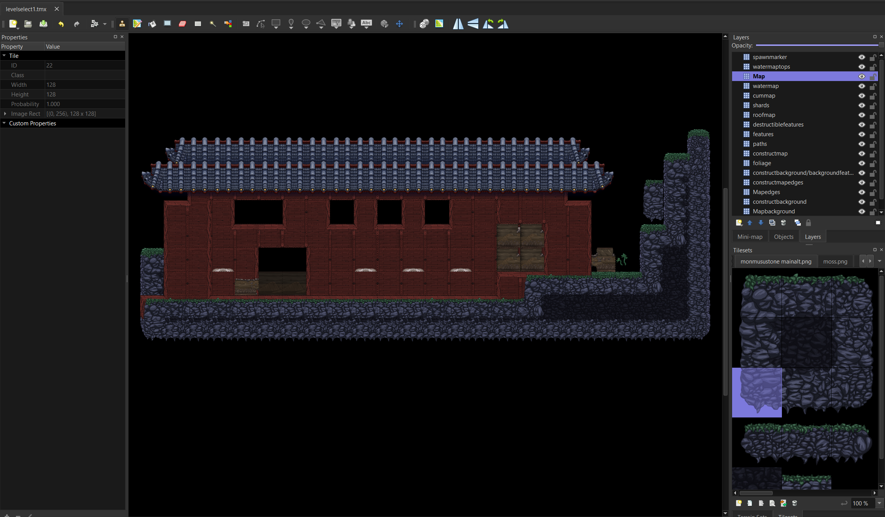
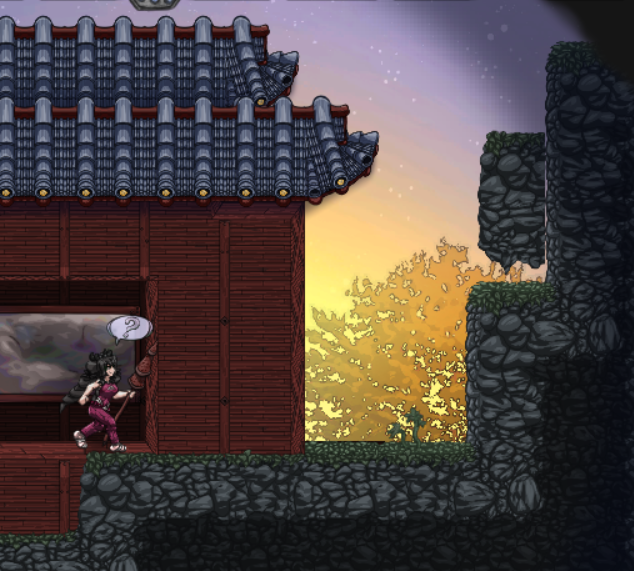

# Tools to work with MonCurse

First, you need to unpack the game ([GDRE]("https://github.com/GDRETools/gdsdecomp/releases/download/v2.4.0/GDRE_tools-v2.4.0-linux.zip")) and get it into dev mode. Godot version [3.5.1](https://github.com/godotengine/godot/releases/3.5.1-stable/) alongside the `Godot_v3.5.1-stable_export_templates` if you wish to publish / test run your mods.

Use GDRE and extract the game into a godot project. Go figure out how if you don't. 

Get python 3.10+ and copy the map/bin_to_tiled.py and map/tiled_to_bin.py into you game extracted folder.

Run it like `python map\bin_to_tiled.py fixedscenes\levelselect1.bin` (or whatever bin and path. Python needs to be ran from the assets root, next to the `Tilemaps` folder and `main.tscn` file. Otherwise it would cause issues)

You'll get a `levelselect1.tmx`, open that in tiled:

Edit whatever you want. It's important to match the exact same tiles ID and source as the original file, otherwise it would cause issues. Tiled suck at linking a layer to a specific tile set, but if you're careful it would work.

Save the file, then re-create the bin from the new tiled map : 
`python map\tiled_to_bin.py levelselect1.tmx`
It would generate a `levelselect1.bin` in the root (yeah sucks but that's a hack script not a final product) and copy that over to replace (backup it, just in case) the `fixedscenes\levelselect1.bin`

Also if you need to study the bin file content, you can with [imhex](https://imhex.werwolv.net) and the handy `stage_bin.hexpat` file from the "map" folder.

Now open the game, and see the changes : 

When things are good, you can use te GDRE patch option to change "mod" the game out. Figure it out too. I'm just providing tools to have fun with stuff.
